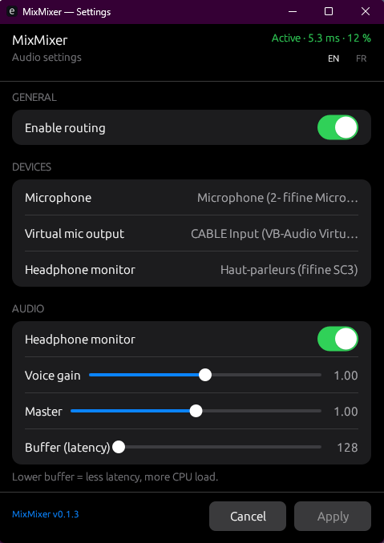

# MixMixer

[](LICENSE)
[](https://github.com/Mestryx-dev/MixMixer)
[](https://github.com/Mestryx-dev/MixMixer/releases)

**MixMixer** is a lightweight Windows system-tray application that routes your **post–Equalizer APO microphone** to **VB-Audio Virtual Cable** with minimal latency. Discord, games, and OBS use **CABLE Output** as the microphone input while your physical mic stays on the E-APO chain.

## Screenshot



## Signal flow

```
Physical mic (post E-APO) ──► MixMixer ──► CABLE Input ──► CABLE Output ──► Discord / games / OBS
                                  │
                                  └──► Headphones (optional monitor)

External soundboard / browser ──► CABLE Input (separate app; Windows mixes with voice)
```

- MixMixer forwards **voice only** to **CABLE Input**.
- Set Discord and games to **CABLE Output** — not the physical mic.
- Soundboard apps can send audio to **CABLE Input** independently; Windows mixes both streams.

## Features

- Low-latency WASAPI capture and playback (Rust + cpal)
- iOS-style settings window (egui) with live latency metrics
- System tray: **left-click or double-click** opens settings; **right-click** → About / Quit
- Hide to tray on close or minimize (does not quit); taskbar click restores the window
- Toast feedback on Apply; GitHub link in the footer
- EN / FR language chips in the header (`locale` in config or `MIXMIXER_LANG`)
- Auto-reconnect when Windows audio devices change (e.g. Discord switching devices)
- Optional headphone monitor bus
- Settings stored in `%APPDATA%\MixMixer\config.json` — created automatically on first run

## Requirements

| Component | Notes |
|-----------|--------|
| Windows 10/11 | x64 |
| [VB-Audio Virtual Cable](https://vb-audio.com/Cable/) | Required — install as administrator |
| [Equalizer APO](https://sourceforge.net/projects/equalizerapo/) | Optional — VST chain on physical mic |
| [Rust toolchain](https://rustup.rs/) + MSVC | For building from source |

## Quick start

### Download (recommended)

1. Download the latest **Windows x64** build from [Releases](https://github.com/Mestryx-dev/MixMixer/releases).
2. Install [VB-Audio Virtual Cable](https://vb-audio.com/Cable/) if needed.
3. Run `mix-mixer.exe` — a default config is created at `%APPDATA%\MixMixer\config.json` (system mic + **CABLE Input** when present).
4. Confirm devices in the settings window, then set Discord / games / OBS microphone to **CABLE Output**.

No manual `config.json` copy is required.

### Build from source

```powershell
cd mix-mixer
cargo build --release
.\target\release\mix-mixer.exe
```

### Wire your apps

1. **Equalizer APO** → physical microphone (optional).
2. **MixMixer** → captures that mic, outputs to **CABLE Input**.
3. **Discord / GTA / OBS** → microphone = **CABLE Output**.

Full walkthrough: [docs/TUTORIAL.md](docs/TUTORIAL.md)

## Configuration

User settings live in:

```
%APPDATA%\MixMixer\config.json
```

Created automatically on first launch with detected defaults. Print the path:

```powershell
.\mix-mixer.exe --print-config-path
```

Optional override: `.\mix-mixer.exe --config D:\path\to\config.json`

| Key | Default | Description |
|-----|---------|-------------|
| `locale` | system / `en` | UI language: `en` or `fr` (overridden by `MIXMIXER_LANG`) |
| `devices.voice_input` | Windows default mic | Capture device (post-E-APO mic) |
| `devices.virtual_mic_output` | `CABLE Input` when found | VB-Cable input endpoint |
| `devices.monitor_output` | default output | Headphone monitor output |
| `monitor.enabled` | `false` | Headphone monitor on/off |
| `monitor.volume` | `1.0` | Local listen level only (does not change Discord / CABLE) |
| `buffer_frames` | `128` | ~2.7 ms @ 48 kHz; increase if crackling |
| `enabled` | `true` | Start with routing active |
| `sample_rate` | `48000` | Sample rate (Hz) |

Device names use **case-insensitive substring** matching. Reference schema: [`mix-mixer/config.example.json`](mix-mixer/config.example.json).

### Language

Use the **FR** / **EN** chips in the settings header, or edit `locale` in the AppData config. Runtime override:

```powershell
$env:MIXMIXER_LANG = "fr"
.\mix-mixer.exe
```

All UI strings live in [`mix-mixer/src/i18n/`](mix-mixer/src/i18n/).

## Settings window

| Control | Action |
|---------|--------|
| Header metrics | Routing state, estimated latency, buffer fill |
| FR / EN chips | Switch UI language (saved to config) |
| Enable routing | Master on/off for mic → VB-Cable |
| Device pickers | Microphone, virtual mic, monitor output |
| Headphone monitor | Toggle local monitoring |
| Listen volume | Level in headphones only (CABLE stays unity) |
| Buffer | Latency / stability trade-off |
| **Apply** | Save and activate (toast; window stays open) |
| **Cancel** | Revert to last applied values |
| Close (×) / minimize | Hide window to tray (app keeps running) |
| Footer version | Opens the [GitHub repository](https://github.com/Mestryx-dev/MixMixer) |

## System tray

| Action | Effect |
|--------|--------|
| Left-click or double-click icon | Open / restore settings |
| Click taskbar window icon (when minimized) | Restore settings |
| Right-click → About | Show about dialog |
| Right-click → Quit | Exit MixMixer |

## Troubleshooting

| Issue | Fix |
|-------|-----|
| Crackling / dropouts | Raise `buffer_frames` to 256 or 512 |
| Device not found | Run `--list-devices`, edit `%APPDATA%\MixMixer\config.json` |
| Discord silent | Mic = **CABLE Output**; routing enabled in MixMixer |
| Silence after Discord device change | Wait for auto-reconnect; do not pick physical mic in Discord |
| Where is my config? | `mix-mixer.exe --print-config-path` or tray → About |
| Debug logs | `$env:RUST_LOG='mix_mixer=info'; .\mix-mixer.exe` |

## Development

```powershell
cd mix-mixer
cargo build
cargo run -- --list-devices
```

Internal notes (French): [`docs/dev-mix-mixer.md`](docs/dev-mix-mixer.md)

## Contributing

See [CONTRIBUTING.md](CONTRIBUTING.md). Bug reports and feature requests: [GitHub Issues](https://github.com/Mestryx-dev/MixMixer/issues).

## License

MIT — see [LICENSE](LICENSE).

## Changelog

See [CHANGELOG.md](CHANGELOG.md).
